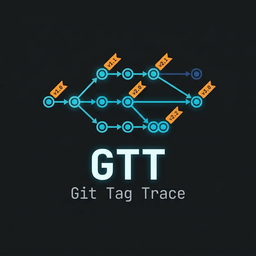
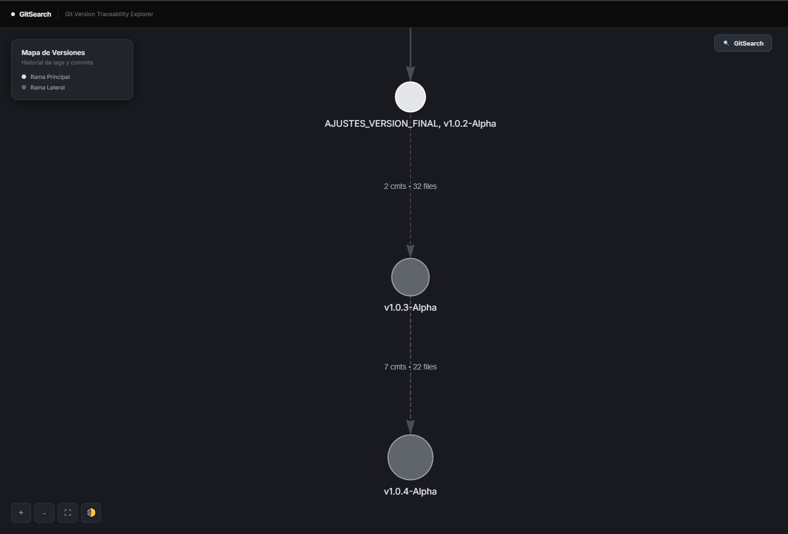
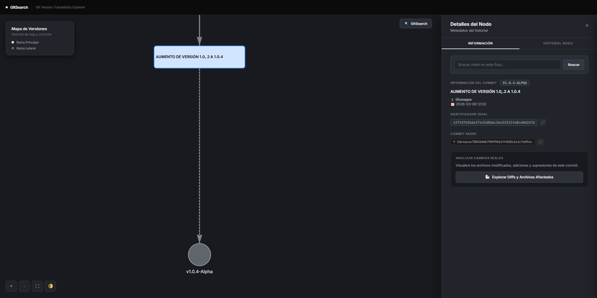
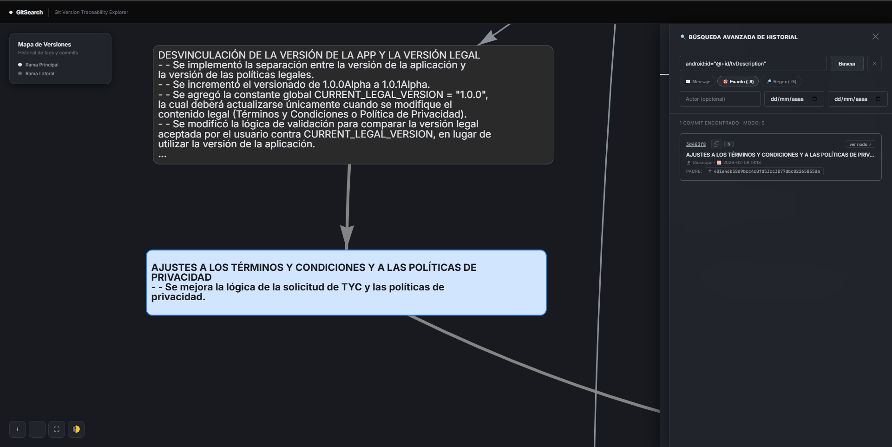

<p align="center">
  
</p>

<h1 align="center">Git Tag Trace</h1>

<p align="center">
  Offline Git Repository Tag & Commit Analyzer
</p>

<p align="center">
  
  
  
  
  
  
</p>

<p align="center">
  <a href="#documentation">Documentation</a> •
  <a href="#quick-start">Installation</a> •
  <a href="#usage">Usage</a>
</p>

---

## Table of Contents

| Section | Description |
|--------|-------------|
| [Features](#features) | Overview of the main capabilities |
| [Screenshots](#screenshots) | Visual examples of the interface |
| [Quick Start](#quick-start) | Installation and first execution |
| [Usage](#usage) | CLI usage examples |
| [Configuration](#configuration) | Environment variables and options |
| [Project Structure](#project-structure) | Repository layout |
| [Development](#development) | Testing, linting, and building |
| [License](#license) | License information |

---

Git Tag Trace (GTT) is an **offline Git repository analyzer** that generates interactive HTML visualizations of tags and commits.  
It provides **topological analysis of version history**, **commit search capabilities**, and **interactive graphs** to explore repository evolution.

---

## Features

- **Tag Analysis** – Extract and analyze all Git tags with metadata (date, author, hash)
- **Topological Graph** – Interactive visualization of version relationships with branch detection
- **Advanced Commit Search** – Multiple search modes: by message (--grep), by diff content (-G), by symbol/function (-L), or pickaxe (-S)
- **Diff Viewing** – View commit changes directly in the HTML interface with syntax highlighting
- **Commit Comparison** – Compare changes between any two tags
- **Commit Modal** – Detailed view of each commit with full diff and parent navigation
- **Interactive Node Expansion** – Double-click tags to reveal all commits in that version
- **Dark/Light Theme** – Toggle between dark and light themes
- **GitSearch Panel** – Advanced search panel for deep repository exploration
- **Offline Operation** – Works completely offline with no external services
- **CLI Interface** – Simple command-line interface for automation

---

## Screenshots

### Interactive Version Graph



*Interactive graph showing tag relationships and repository structure.*

### Commit Details Panel



*Click on any node to view commit details, changed files, and diffs.*

### Search Interface



*Search commits by message, author, file path, or regex pattern.*

---

## Quick Start

### Prerequisites

- Python **3.11+**
- **Git** installed and available in `PATH`
- **Windows** (current supported platform)

---

### Installation

1. Clone or download this repository.

2. Create or edit the `.env` file:

```env
REPO_PATH=C:\path\to\your\repository
OUTPUT_FILE=reporte.md
```

3. Run `start.bat` or use uv directly:

```bash
# Install dependencies
python -m uv sync --all-groups

# Run the analyzer
python -m uv run git-tag-trace C:\path\to\repo --output reporte.md
```

## Usage

### Basic Analysis

```bash
# Analyze a repository and generate report
python -m uv run git-tag-trace C:\path\to\repo

# With custom output file
python -m uv run git-tag-trace C:\path\to\repo --output my-report.md

# With deep search (search by hash, message, or code)
python -m uv run git-tag-trace C:\path\to\repo --search "feature"
```

### Output Files

- **reporte.txt**: Text report with tag list, commit history, and comparison between tags
- **reporte_grafo.html**: Interactive HTML with visualization, search, and commit details

## Configuration

### Environment Variables

Create a `.env` file in the project root:

```env
# Path to the Git repository to analyze
REPO_PATH=C:\path\to\repository

# Output file name (optional)
OUTPUT_FILE=reporte.md

# Tag prefixes to clean from labels (comma-separated)
TAG_PREFIXES=release_,v
```

### Command Line Options

```
git-tag-trace <repo_path> [options]

Options:
  --output FILE, -o FILE   Output markdown file (default: reporte.txt)
  --search CRITERIO, -s CRITERIO  Search commits by hash, message, or code diff
  --help                  Show help message
```

## Project Structure

```
git-tag-trace/
├── gitsearch/           # Main package
│   ├── __main__.py      # CLI entry point
│   ├── engine.py        # Search engine
│   ├── filters.py       # Parameter validation
│   ├── strategy.py      # Git command strategies
│   └── html_builder.py  # HTML generation
├── tests/               # Test suite
├── docs/                # Documentation
│   └── screenshots/     # Project screenshots
├── pyproject.toml       # Project configuration
├── start.bat            # Windows launcher
└── README.md
```

## Development

### Running Tests

```bash
# Run all tests
python -m uv run pytest

# Run single test
python -m uv run pytest tests/test_filters.py::test_validar_texto_con_espacios

# With coverage
python -m uv run pytest --cov=gitsearch --cov-report=term-missing
```

### Linting & Type Checking

```bash
# Lint code
python -m uv run ruff check .

# Format code
python -m uv run ruff format .

# Type check
python -m uv run ty check gitsearch/
```

### Building

```bash
# Build package
python -m uv build
```

## Interactive HTML Features

The generated HTML file (`reporte_grafo.html`) includes:

- **Node Interaction**: Click any tag node to view commit details
- **Commit Explorer**: View all commits in a specific version
- **Diff Viewer**: Click "Analizar Cambios Reales" to see file changes
- **Theme Toggle**: Use the moon/sun icon to switch between dark and light modes
- **GitSearch Panel**: Click the "GitSearch" button for advanced search capabilities
- **Navigation**: Click parent commits to navigate through history
- **Zoom & Pan**: Mouse wheel to zoom, drag to pan the graph

### Keyboard Shortcuts

- **Click node**: Open details panel
- **Double-click node**: Expand to show all commits in that version
- **Click parent link**: Navigate to parent commit

## License

Apache License 2.0 - see [LICENSE](LICENSE) file for details.

## Acknowledgments

- [GitPython](https://gitpython.readthedocs.io/) - Git interface for Python
- [vis-network](https://visjs.org/) - Interactive network visualization